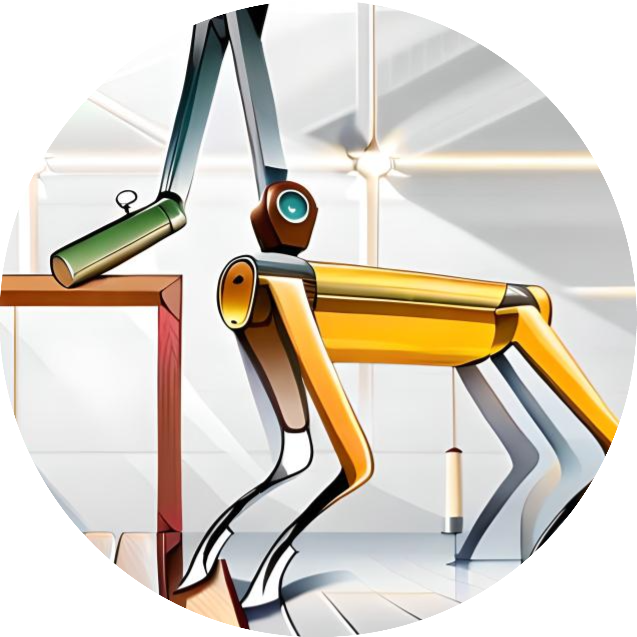

# 1. About the project <a name="atp"></a>
 **Course:**  Multidisciplinary Project (RO47007) \
 **Program:** Msc Robotics @ TU Delft            
 **Developer Group:**  Group 19 - SpotOnCare                    
 **Last Maintained Date:**  01.06.2023   


This repository is part the submission for the project of the course **Multidisciplinary Project (RO47007)**, in collaboration with  [TNO](https://www.tno.nl/en?gclid=.CjwKCAjw1MajBhAcEiwAagW9MSsTkBs0QeVZAyaxq9Fz1mtmGNJCkYzUVTuIwKk3bHhMCr6WwW6XnhoCvmsQAvD_BwE).

 

 



#### Project Description
In this project the SPOT robot will navigate through a care environment. For the sake of simplicity the demo will take place on a flat floor with no stairs or height differences. The SPOT robot that is currently available at CoR is operated using ROS driver. With the ROS driver it is able to send Twist ROS messages to move the robot. The SPOT is also equipped with an arm. This will be pick up hand-sized objects and place them somewhere else.

#### Challenge
The primary challenge of this project is to develop an object delivery system where the SPOT robot picks up a specific object. Once the object is grasped, the robot should navigate within a predefined space, searching for the correct person to deliver the object. The robot's camera will be used to detect and identify the correct person. In case SPOT has found the person the Spot will walk to the person and place the object on the ground. The operation of the arm is done manually.

#### Acknowledgments
The project group would like to express our gratitude to the TNO company for providing this exciting case study and opportunity. Additionally, the project group appreciates the support and resources provided by CoR for providing the SPOT robot and available simulation for this project.

# Table of Contents

1.  [About the project](#atp) 
2.  [Node overview](#nov)
3.  [Installation](#ins)

    3.1.  [Champ's Spot dependency installation](#ins_champ)

    3.2.  [Installing Spot ROS driver](#ins_spot)

    3.3.  [Installing project dependencies](#ins_project)

    3.4.  [Confirming installation](#ins_confirm)


# 2. Node overview <a name="nov"></a>

This repository contains all necessary files to build all 11 ROS nodes of the 8 packages, namely: 

- explore ([Link to README](explore/README.md))
    - ``explore`` 

- human interaction ([Link to README](human_interaction/README.md))
    - ``bracelet_gui_node`` 
    - ``conversation_server``
    

- motion control ([Link to README](motion_control/README.md))
    - ``motion_control``

- rrt ([Link to README](rrt/README.md))
    - ``rrt_path_node``

        
- slam ([Link to README](slam/README.md))
    - ``image2pointcloud`` 
    - ``plane_segmentation``
    - ``occupancy_map`` 

- state machine ([Link to README](state_machine/README.md))
    - ``state_machine``

- yolo ([Link to README](yolo/README.md))
    - ``detection``


These nodes can be used in combination with the other ROS nodes contained in the parent repository ``champ_spot`` to simulate and run autonomous missions designed for the healthcare sector on a [Boston Dynamics SPOT robot](https://www.bostondynamics.com/products/spot).


This README file contains the overarching information about the packages and the necessary installation steps, while the README files in the subdirectories (linked behind each package heading) contain more specific information about the usage of the individual nodes as well as how to confirm successful installation.


# 3. Installation <a name="ins"></a>


## 3.1. Champ's Spot dependency installation<a name="ins_champ"></a>

This repository is based on [CHAMP](https://github.com/chvmp/champ) and [zoo](https://github.com/chvmp/robots) repositories. Tested on Ubuntu Focal 20.04 (ROS Noetic).


Clone and install all dependencies:
```bash
sudo apt install -y python3-rosdep
cd <your_ws>/src
git clone --recursive https://github.com/chvmp/champ
git clone https://github.com/chvmp/champ_teleop
cd ..
rosdep install --from-paths src --ignore-src -r -y
```
### Spot robot simulation

You need a git SSH key setup. Navigate to `src` directory in your workspace, then:
```bash
 git clone https://gitlab.tudelft.nl/cor/ro47007/2023/team-19/champ_spot
 cd champ_spot
 git submodule init
 git submodule update
```

### Build your workspace

```bash
 cd <your_ws>
 catkin build
 source <your_ws>/devel/setup.bash
```
* `Resource not found: yocs_velocity_smoother` error might occur; in that case, build your workspace again.

### Gazebo Worlds
Add `models` directory to the GAZEBO_MODEL_PATH environment variable. You can add the following line to the end of your ~/.bashrc:
```bash
export GAZEBO_MODEL_PATH=$GAZEBO_MODEL_PATH:<path to>/models
```
Examples: https://github.com/leonhartyao/gazebo_models_worlds_collection

### Quick Start Guide

Run the Gazebo environment:
```bash
roslaunch spot_config spawn_world.launch
```

Spawn the robot:
```bash
roslaunch spot_config spawn_robot.launch rviz:=true
```

In the simulation, only robot's front cameras are available. Note that the cameras are mounted sideways, so they have a narrower horizontal FoV, but a larger vertical one. The camera data is rotated anticlockwise by 90 degrees.

<br/>  
        
        

## 3.2 Installing Spot ROS driver <a name="ins_spot"></a>
In order to install the driver, follow the README instructions from [Boston Dynamic's Spot](https://github.com/clearpathrobotics/spot_ros) repository. This driver will be used later on with the real robot. It requires a different workspace.

<br/>  

## 3.3 Installing project dependencies <a name="ins_project"></a>

```python
actionlib==1.14.0
bosdyn_api==3.2.3
bosdyn_client==3.2.3
bosdyn_core==3.2.3
bosdyn_mission==3.2.3
customtkinter==5.1.3
cv_bridge==1.16.2
matplotlib==3.1.2
message_filters==1.16.0
numpy==1.17.4
protobuf==3.6.1
pyaudio==0.2.13
pyttsx3==2.90
PyYAML==6.0
PyYAML==6.0
rosbag==1.16.0
rospkg==1.5.0
rospkg==1.5.0
rospkg_modules==1.5.0
rospy==1.16.0
sensor_msgs==1.13.1
smach==2.5.1
smach_ros==2.5.1
SpeechRecognition==3.10.0
tf==1.13.2
tf2_ros==0.7.6
ttkthemes==3.2.2
```
This can be done either manually or with these commands :

```bash
cd path/to/champ_spot
pip install -r requirements.txt
```

If your machine does not yet have a speech engine installed, you can install [espeak](https://espeak.sourceforge.net/) with the following command:
```bash 
sudo apt-get install espeak
```

You need to download the weights for the yolo package inside of its configuration folder, this can be done with the folowing commands:
```bash
cd path/to/champ_spot/yolo/yolo_config
wget https://github.com/AlexeyAB/darknet/releases/download/yolov4/yolov7x.weights
```


Build your workspace

```bash
 cd <your_ws>
 catkin build
 source <your_ws>/devel/setup.bash
```
<br/>    

## 3.4 Confirming installation <a name="ins_confirm"></a>
To confirm that all the packages are installed correctly, refer to the linked READMEs of each package:

- [README explore](explore/README.md)

- [README human_interaction](human_interaction/README.md)

- [README motion_control](motion_control/README.md)

- [README rrt](rrt/README.md)

- [README slam](slam/README.md)

- [README state_machine](state_machine/README.md)

- [README yolo](yolo/README.md)

