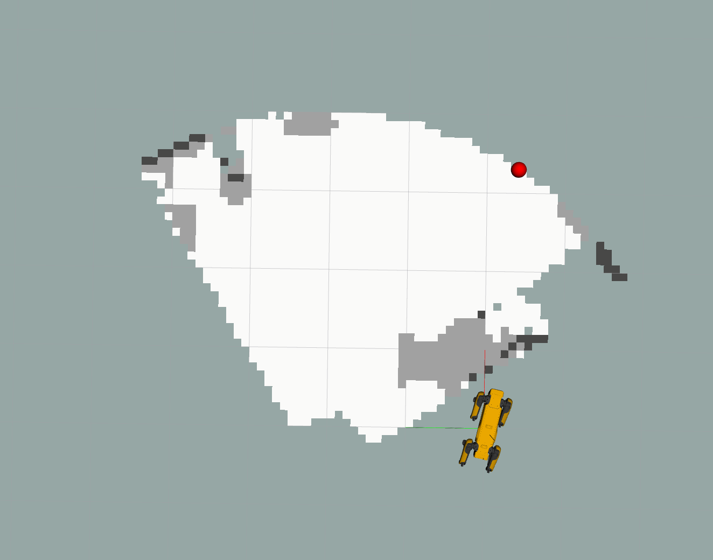
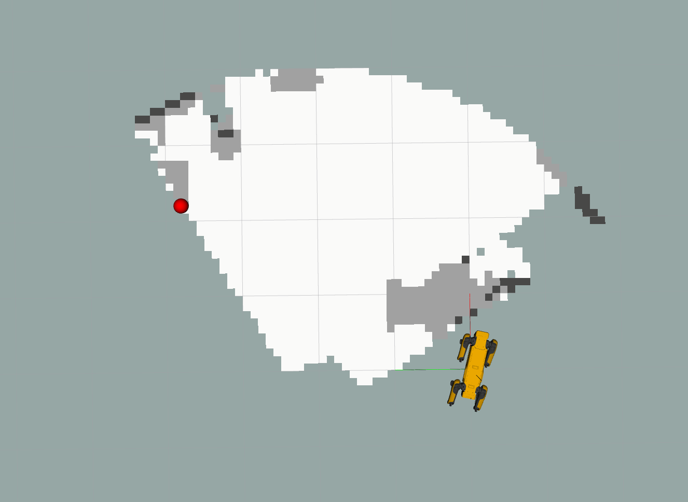
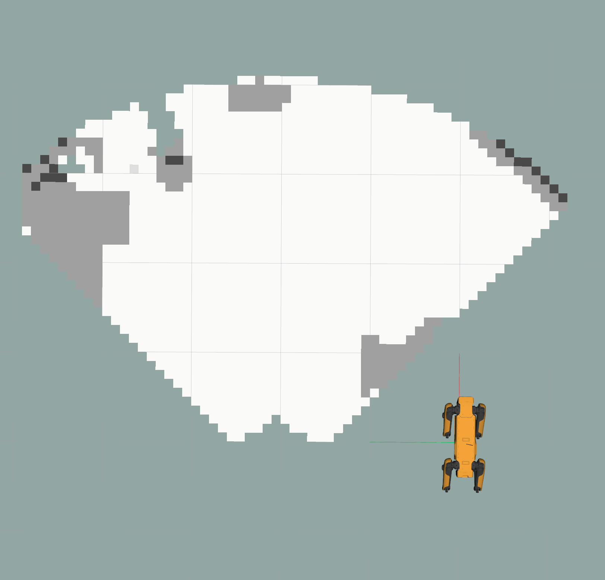

# 1. About the package <a name="atp"></a>
 **Course:**  Multidisciplinary Project (RO47007) \
 **Program:** Msc Robotics @ TU Delft            
 **Developer Group:**  Group 19 - SpotOnCare                     
 **Last Maintained Date:**  01.06.2023   


This repository is part the submission for the project of the course **Multidisciplinary Project (RO47007)**, in collaboration with  [TNO](https://www.tno.nl/en?gclid=.CjwKCAjw1MajBhAcEiwAagW9MSsTkBs0QeVZAyaxq9Fz1mtmGNJCkYzUVTuIwKk3bHhMCr6WwW6XnhoCvmsQAvD_BwE).


This package provides the necessary code to build and run the exploring which is part of the planning/navigation part of the project.

  
It contains all necessary files to build one ROS node, namely:
- ``explore``

These packages can be used in combination with the other ROS packages contained in the parent repository ``champ_spot`` to simulate and run autonomous missions designed for the healthcare sector on a [Boston Dynamics SPOT robot](https://www.bostondynamics.com/products/spot).

--- 

# Table of Contents

1.  [About the package](#atp) \
    1.1 [ROS-Node explore](#r1)

2. [Usage](#u)\
    3.1 [Starting the simulation](#rsim)\
    3.2 [Running Explore](#rslam)\
    3.3 [Running all the nodes individually](#rind)
    
    
3. [File Structure](#fs)


---

<p>&nbsp;</p>


## ROS-Node explore <a name="r1"></a>
The ``explore`` node contains the file that is needed for SPOT to autonomously explore the room. The exploring is based of the Frontier Based Exploration Algorithm that uses the OccupancyGrid to compute the frontiers using gradients. When the node is called, it finds a random point on the frontier. This point send to the ``rrt_path`` server using a MoveBaseGoal. The node publishes a Marker and a CostMap for visualizing purposes.  


This node is subscribed and publishes to the topics below.
| **Subscribes:**               | **Client to server:**     | **Publishes:**                    |
|-------------------------------|---------------------------|-----------------------------------|
| /spot/mapping/occupancy_grid  | rrt_path                  | /spot/depth/frontright/pointcloud |
| /odom/ground_truth            |                           | /spot/depth/frontleft/pointcloud  |

Two different results of the node could be like:
<div style="text-align:center">
  
 
</div>

> Note: The robots position in Rviz does not match the robot position used by the occupancy map. This difference is due to a simulation error and/or position drift. Therefore, it is recommended to hide the robot model in Rviz. The red marker represents goal position. 


# 2. Usage <a name="u"></a>

After building the packages and sourcing your workspace (follow all the steps in **Getting started**) each of the contained nodes in the workspace can be started using ``roslaunch`` and the provided launch files. However, because all the nodes described in this README depend on each other, it is recommended to launch them all at once after the World in Gazebo and SPOT in Rviz have spawned.


### Starting the simulation <a name="rsim"></a>
The simulation should be running (the world in Gazebo and SPOT in Rviz), before the nodes within this package can be launched. This can be done using the two commands below.

Launch the world in Gazebo.
```console
roslaunch spot_config spawn_world.launch
```
Launch SPOT in Rviz.
```console
roslaunch spot_config spawn_robot.launch
```

This will startup both Gazebo and Rviz, SPOT should also be visible wihtin the Gazebo world.

<div style="text-align:center">
 
</div>

### Running Explore <a name="rslam"></a>
If the simulation started, all the nodes described within this README can be launched using one launch file:
```console
roslaunch explore full_explore.launch
```


#### Occupancy map
The created occupancy map can be visualized in Rviz by clicking on:
``Panels`` &rarr; ``Add`` &rarr; ``Topics`` &rarr; ``/spot/mapping/occupancy_grid``

This should display the occupancy map as shown in the image below. 

<div style="text-align:center">
 
</div>

> Note: The robots position in Rviz does not match the robot position used by the occupancy map. This difference is due to a simulation error and/or position drift. Theirfore, it is recomanded to hide the robot model in Rviz.


#### Explore
To test whether the ``explore`` node has succesfully launched, the result of the node can be visualized by clicking on: 
``Panels`` &rarr; ``Add`` &rarr; ``Topics`` &rarr; ``/spot/mapping/active_slam/goal``.

This should show a similar result as the image above. However, the goal may not be exactly the same due the goal being a random goal in the frontier.


### Running all the nodes individually <a name="rind"></a>
The Explore package consists only of the ``explore`` node. However for this node to run, other depencies from other packages also need to run. 

Run the the node ``explore.py`` from SLAM:
````console
rosrun slam explore.py
````

Run the node ``rrt_path``:
````console
roslaunch rrt rrt.launch
````

Run the package Mapping:
````console
roslaunch slam mapping.launch
````


> Note: Each command needs to be run in a new terminal that is sourced each time. 

## 3. File Structure <a name="fs"></a>
````
├── CMakeLists.txt              # CMakeLists.txt for the package
├── images                      # Images used in the README
│   ├── explore_1.png
│   ├── explore_3.png
│   └── simulation.png
├── launch                      # Launch files  
│   ├── explore.launch
│   └── full_explore.launch
├── package.xml
├── README.md
└── src
    └── explore.py              # Definition of the explore node

````

