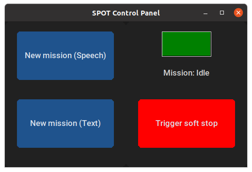
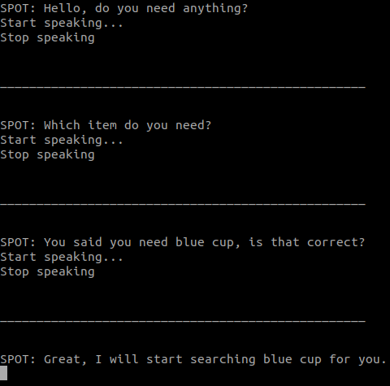
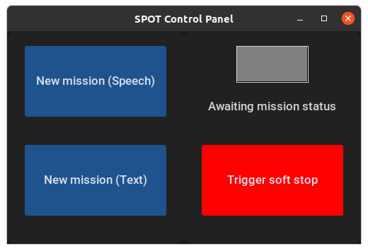
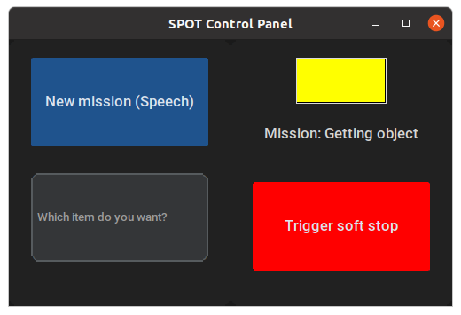

# 1. About the package <a name="atp"></a>
 **Course:**  Multidisciplinary Project (RO47007) \
 **Program:** Msc Robotics @ TU Delft            
 **Developer Group:**  Group 19 - SpotOnCare                     
 **Last Maintained Date:**  01.06.2023   


This repository is part the submission for the project of the course **Multidisciplinary Project (RO47007)**, in collaboration with  [TNO](https://www.tno.nl/en?gclid=.CjwKCAjw1MajBhAcEiwAagW9MSsTkBs0QeVZAyaxq9Fz1mtmGNJCkYzUVTuIwKk3bHhMCr6WwW6XnhoCvmsQAvD_BwE).


The package provides the necessary code to build and run the human-interation part.

  
It contains all necessary files to build two ROS nodes, namely: 
- ``bracelet_gui_node`` 
- ``conversation_server`` 

These packages can be used in combination with the other ROS packages contained in the parent repository ``champ_spot`` to simulate and run autonomous missions designed for the healthcare sector on a [Boston Dynamics SPOT robot](https://www.bostondynamics.com/products/spot).

--- 

# Table of Contents

1.  [About the package](#atp) \
    1.1 [ROS-Node bracelet_gui_node](#r1)\
    1.2 [ROS-Node conversation_server](#r2)

2. [Getting Started](#gs)\
    2.1 [Prerequisites](#pr)\
    2.2 [Installation](#i)

3. [Usage](#u)\
    3.1 [Running the bracelet_gui_node](#rbrac)\
    3.2 [Running the conversation server](#rconv)
    
    
4. [File Structure](#fs)


---

<p>&nbsp;</p>


## ROS-Node bracelet_gui_node <a name="r1"></a>
The package contains all the necessary files to build and run ``bracelet_gui_node`` that will enable:
- giving SPOT missions via text input or speech input 
- display the current mission status of SPOT
- triggering the soft stop function when necessary

The GUI after startup should look like this:

<div style="text-align:center">
 
</div>

## ROS-Node conversation_server <a name="r2"></a>
The package contains all the necessary files to build and run the ``conversation_server`` that will:

- listen to the user's speech input
- transcribe the speech input to text
- make a simple conversation to determine which object the human requires
- trigger the ROS action server to start the mission with the required object

An example of the conversation is shown below:

<div style="text-align:center">
 
</div>


# 2. Getting Started <a name="gs"></a>
## Prerequisites <a name="pr"></a>
This project was developed and tested on a Ubuntu 20.04 LTS machine running ROS Noetic. The following steps will guide you through the process of setting up the workspace and running the project.


## Installation <a name="i"></a>
**1. CHAMP installation**

If you have not done so yet, follow the instructions to setup the CHAMP workspace on your machine: 
[CHAMP Installation](https://gitlab.tudelft.nl/cor/ro47007/2023/team-19/champ_spot). This will guide you through the installation of our version of the CHAMP repository containing all the necessary packages to run the project.


**2. Install the following dependencies:**

```
actionlib==1.14.0
customtkinter==5.1.3
pyaudio==0.2.13
pyttsx3==2.90
rospy==1.16.0
SpeechRecognition==3.10.0
ttkthemes==3.2.2
```
This can be done either manually or with these commands :

```
cd path/to/champ_spot/human_interaction
pip install -r requirements.txt
```

If your machine does not yet have a speech engine installed, you can install [espeak](https://espeak.sourceforge.net/) with the following command:
```
sudo apt-get install espeak
```


For the GUI

'''
sudo apt-get install python3-tk

pip install customtkinter

'''

# 3. Usage <a name="u"></a>

After building the packages and sourcing your workspace (follow all the steps in **Getting started**) each of the contained nodes in the workspace can be started using ``roslaunch`` and the provided launch files.


### Running the ``bracelet_gui_node`` <a name="rbrac"></a>

```
roslaunch human_interaction bracelet_gui.launch
```
This will startup both the GUI and the ``conversation_server`` nodes and open a new window with the GUI. The GUI will look like this after startup:

<div style="text-align:center">
 
</div>


If the installation was successful, after clicking the button ``New mission(Speech)`` the conversation should start in the terminal with the following question that is both displayed and read out loud:
```
SPOT: Hello, I am SPOT you assistance dog, do you need anything?
```
After giving an affirmative answer to the question, the next question will be asked:
``` 
SPOT: Which item do you need?
```
The conversation will continue, but these two steps verify your installation was successful, since it tests GUI, speech recognition, text-to-speech and the speech engine.

Clicking on the button ``New mission(Text)`` will open a text entry field (Which item do you want?) where the user can type in the mission/ object to get. It should look like this:
<div style="text-align:center">
 
</div>


The top right status field will display the current status of the mission. The status can be one of the following:

- GREEN: SPOT is available and ready to start a new mission
- YELLOW: SPOT is currently executing a mission
- RED: SPOT is currently not available or the soft stop function is triggered

The status is determined by the rostopic ``/spot/mission_status`` that is published by the ``state_machine`` node from the package ``state_machine``. The ``state_machine`` node is responsible for executing the missions and publishing the current status of the mission.

The button ``Trigger soft stop`` can be used to trigger the soft stop function. This will trigger the rosservice ``/spot/soft_stop`` that triggers SPOT's soft stop. The statemachine will publish a status message ``RED`` to the rostopic ``/spot/mission_status``.

### Running the ``conversation_server`` <a name="rconv"></a>

```
roslaunch human_interaction conversation_server.launch
```
This will startup only the ``conversation_server`` node. This is useful for running the project without using the ```bracelet_gui_node```. The ```state_machine``` node from the package ```state_machine ``` can be used to trigger the ```conversation_server``` node that implements the ROS action server for running conversations with the user to determine objects to get.
If the installation was succesfull the conversation server should start in the terminal with a similar message:

```
[INFO] [1685183869.602140]: Action Server Conversation started...
```


## 4. File Structure <a name="fs"></a>

````
├── action                          # Action files for the conversation server
│   └── Conversation.action         
├── CMakeLists.txt                  # CMakeLists.txt for the package
├── config
│   └── recognize_speech.yaml       # Configuration file for the speech recognition
├── images                          # Images used in the README
│   ├── bracelet_GUI_1.png          
│   ├── bracelet_gui_2.png
│   ├── bracelet_GUI_2.png
│   └── conversation.png
├── launch                          # Launch files for the package
    ├── bracelet_gui.launch                      
    ├── conversation_client.launch
    └── conversation_server.launch
├── package.xml                     # Package.xml for the package
├── plugin.xml          
├── README.md                       # README
└── scripts                         # Scripts used in the package
    ├── bracelet_gui.py
    ├── recognize_speech_client.py
    └── recognize_speech.py

```` 
