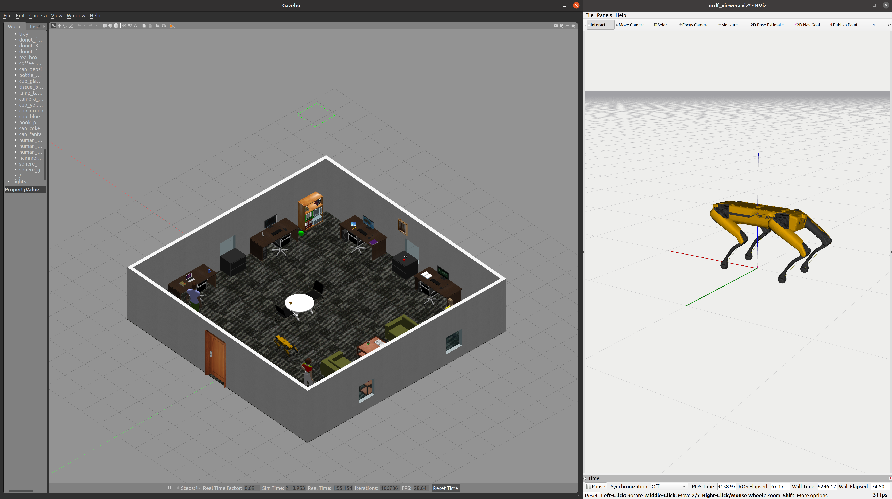

# 1. About the package <a name="atp"></a>
 **Course:**  Multidisciplinary Project (RO47007) \
 **Program:** Msc Robotics @ TU Delft            
 **Developer Group:**  Group 19 - SpotOnCare                     
 **Last Maintained Date:**  01.06.2023   


This repository is part the submission for the project of the course **Multidisciplinary Project (RO47007)**, in collaboration with  [TNO](https://www.tno.nl/en?gclid=.CjwKCAjw1MajBhAcEiwAagW9MSsTkBs0QeVZAyaxq9Fz1mtmGNJCkYzUVTuIwKk3bHhMCr6WwW6XnhoCvmsQAvD_BwE).


The package provides the necessary code to build and run the RRT-algorithm that is part of the planning/navigation part of the assignment.

  
It contains all necessary files to build the one ROS node, namely: 
- ``motion_control`` 

TThis package can be used in combination with the other ROS packages contained in the parent repository ``champ_spot`` to simulate and run autonomous missions designed for the healthcare sector on a [Boston Dynamics SPOT robot](https://www.bostondynamics.com/products/spot).

--- 

# Table of Contents

1.  [About the package](#atp) \
    1.1 [ROS-Node motion_control](#r1)


2. [Installation](#inst)

3. [Usage](#u)\
    2.1 [Starting the simulation](#rsim)\
    2.2 [Running Motion_Control](#rslam)
    
    
4. [File Structure](#fs)


---

<p>&nbsp;</p>


## ROS-Node motion_control_node <a name="r1"></a>
The ``motion_control`` node contains the file that is neccesary to send SPOT from one location in the OccupancyGrid to one another. This node acts as an ActionServer that receives MoveBaseGoal and by sending linear and angular velocities to the driver it allows SPOT to reach the goal that started the Action. Once the goal is reached the action is succeeded and this is send to the server. 

This node is subscribed and publishes to the topics below and is client to the server below.
| **Subscribes:**               | **Client to server:**     | **Publishes:**         |
|-------------------------------|---------------------------|------------------------|
| /spot/mapping/grid_location   | motion_control            | cmd_vel                |

The node should receive the current position in the OccupancyGrid like this: ``[x, y, yaw]`` where x and y can be between 0-150 and yaw in radians between -pi and pi. It receives the goal as a MoveBaseGoal like this:
````
MoveBaseGoal:
  target_pose:
    header:
      seq: 0
      stamp:
        secs: 0
        nsecs: 0
      frame_id: ''
    pose:
      position:
        x: 63.0
        y: 11.0
        z: 0.0
      orientation:
        x: 0.0
        y: 0.0
        z: 0.0
        w: 0.0

````
Where x and y represent the goal position in the OccupancyGrid. 

The node sends a velocity command as a Twist message that looks like this:
````
Twist:
  linear:
    x: 0.5
    y: 0.0
    z: 0.0
  angular:
    x: 0.0
    y: 0.0
    z: 0.0

````


# 2. Installation <a name="inst"></a>

**Install all dependencies:**

```bash
pip install -r requirements.txt
```


# 3. Usage <a name="u"></a>

After building the packages and sourcing your workspace (follow all the steps in **Getting started**) each of the contained nodes in the workspace can be started using ``roslaunch`` and the provided launch files. However, because all the nodes described in this README depend on each other, it is recommended to launch them all at once after the World in Gazebo and SPOT in Rviz have spawned.


### Starting the simulation <a name="rsim"></a>
The simulation should be running (the world in Gazebo and SPOT in Rviz), before the nodes within this package can be launched. This can be done using the two commands below.

Launch the world in Gazebo.
```console
roslaunch spot_config spawn_world.launch
```
Launch SPOT in Rviz.
```console
roslaunch spot_config spawn_robot.launch
```

This will startup both Gazebo and Rviz, SPOT should also be visible wihtin the Gazebo world.

<div style="text-align:center">
 
</div>

## Running Motion_Control <a name="rslam"></a>
If the simulation started, all the nodes described within this README can be launched using one launch file:
```console
roslaunch motion_control motion_control.launch
```

To test whether the ``motion_control`` node has succesfully launched without using other packages, one could give the node manually a goal. To do this you first need to open another terminal and source this. Then the following command can be run:
````
rostopic pub /motion_control/goal move_base_msgs/MoveBaseActionGoal "{
  header: {
    seq: 0,
    stamp: { secs: 0, nsecs: 0 },
    frame_id: ''
  },
  goal_id: {
    stamp: { secs: 0, nsecs: 0 },
    id: ''
  },
  goal: {
    target_pose: {
      header: {
        seq: 0,
        stamp: { secs: 0, nsecs: 0 },
        frame_id: 'map'
      },
      pose: {
        position: {
          x: 63.0,
          y: 11.0,
          z: 0.0
        },
        orientation: {
          x: 0.0,
          y: 0.0,
          z: 0.0,
          w: 0.0
        }
      }
    }
  }
}"
```` 
If launched correctly, SPOT should be moving the the position (63, 11) in the OccupancyGrid. 

## 4. File Structure <a name="fs"></a>
````
├── CMakeLists.txt                  # CMakeLists.txt for the package
├── launch
│   └── motion_control.launch       # Launch file
├── package.xml
├── README.md
└── src
    └── motion_control.py           # Definition of the motion_control node
    ````
