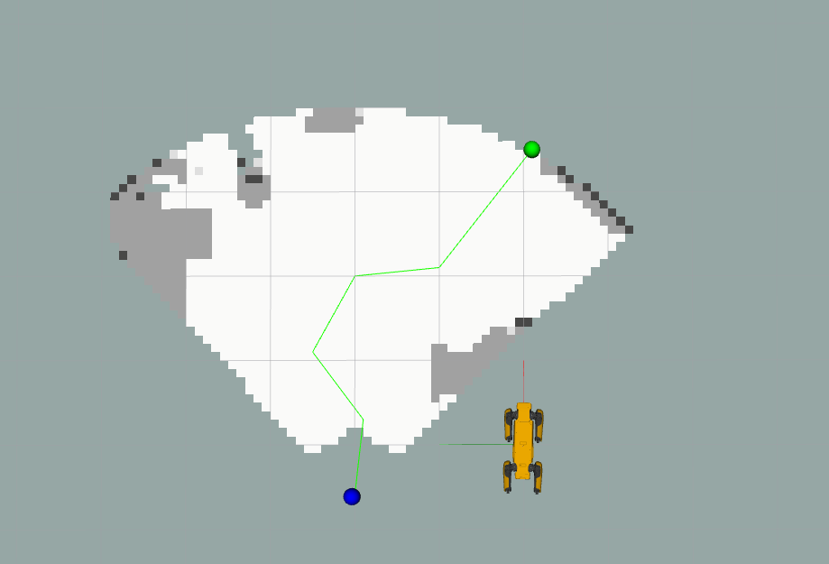

# 1. About the package <a name="atp"></a>
 **Course:**  Multidisciplinary Project (RO47007) \
 **Program:** Msc Robotics @ TU Delft            
 **Developer Group:**  Group 19 - SpotOnCare                     
 **Last Maintained Date:**  01.06.2023   


This repository is part the submission for the project of the course **Multidisciplinary Project (RO47007)**, in collaboration with  [TNO](https://www.tno.nl/en?gclid=.CjwKCAjw1MajBhAcEiwAagW9MSsTkBs0QeVZAyaxq9Fz1mtmGNJCkYzUVTuIwKk3bHhMCr6WwW6XnhoCvmsQAvD_BwE).


The package provides the necessary code to build and run the RRT-algorithm that is part of the planning/navigation part of the assignment.

  
It contains all necessary files to build the one ROS node, namely: 
- ``rrt_path`` 

TThis package can be used in combination with the other ROS packages contained in the parent repository ``champ_spot`` to simulate and run autonomous missions designed for the healthcare sector on a [Boston Dynamics SPOT robot](https://www.bostondynamics.com/products/spot).

--- 

# Table of Contents

1.  [About the package](#atp) \
    1.1 [ROS-Node rrt_path](#r1)

2. [Usage](#u)\
    3.1 [Starting the simulation](#rsim)\
    3.2 [Running RRT](#rslam)\
    3.3 [Running all the nodes individually](#rind)
    
    
3. [File Structure](#fs)


---

<p>&nbsp;</p>


## ROS-Node rrt_path <a name="r1"></a>
The ``rrt_path`` node contains the file that computes the path for SPOT to follow. This path is computed using the Rapidly exploring Random Tree algorithm in the OccupancyGrid. The node acts as an ActionServer that is triggered when it receives a MoveBaseGoal. After receiving the goal the path is computed. For each point in this path the ``motion_control`` ClientServer is called, after this servers notifies a succes, the next point in the path is send to the server. For testing purposes the ``rrt_path`` node publishes two Marker and one Path message to visualize the result. 


This node is subscribed and publishes to the topics below and is client to the server below.
| **Subscribes:**               | **Client to server:**     | **Publishes:**                |
|-------------------------------|---------------------------|-------------------------------|
| /spot/mapping/grid_location   | motion_control            | /spot/planning/path_steps     |
| /spot/mapping/occupancy_grid  | rrt_path                  | /spot/planning/path_marker    |
|                               |                           | /spot/planning/path_marker2   |

The vizualized result of the ``rrt_path`` node should look like this:
<div style="text-align:center">
 
</div>

> Note: Due to troubleshooting the SPOT is not ready moving steadily to the goal. This is caused by the RRT path being to tight around obstacles. We are currently working on adding more constraints to the algorithm so that this will be fixed. 

> Note: he robots position in Rviz does not match the robot position used by the occupancy map. This difference is due to a simulation error and/or position drift. Therefore, it is recommended to hide the robot model in Rviz. The blue marker represents the robot position. 

# 2. Usage <a name="u"></a>

After building the packages and sourcing your workspace (follow all the steps in **Getting started**) each of the contained nodes in the workspace can be started using ``roslaunch`` and the provided launch files. However, because all the nodes described in this README depend on each other, it is recommended to launch them all at once after the World in Gazebo and SPOT in Rviz have spawned.


### Starting the simulation <a name="rsim"></a>
The simulation should be running (the world in Gazebo and SPOT in Rviz), before the nodes within this package can be launched. This can be done using the two commands below.

Launch the world in Gazebo.
```console
roslaunch spot_config spawn_world.launch
```
Launch SPOT in Rviz.
```console
roslaunch spot_config spawn_robot.launch
```

This will startup both Gazebo and Rviz, SPOT should also be visible wihtin the Gazebo world.

<div style="text-align:center">
 
</div>

### Running RRT <a name="rslam"></a>
If the simulation started, the node described in this README can be started together with all the packages it needs to run with one launch file:
````console
roslaunch rrt full_rrt.launch
````

To test whether the ``rrt_path`` node has succesfully launched, the result of the node can be visualized by clicking on: 
``Panels`` &rarr; ``Add`` &rarr; ``Topics`` &rarr; ``/spot/planning/path_steps``, ``Add`` &rarr; ``Topics`` &rarr; ``/spot/planning/path_marker`` and ``Add`` &rarr; ``Topics`` &rarr; ``/spot/planning/path_marker2``. 

This should show a similar result as the image above. However, the goal and path may not be exactly the same due the goal being a random goal in the frontier and the path being random by nature. 

### Running all the nodes individually <a name="rind"></a>
The RRT package consists only of the ``rrt_path`` node. However for this node to run, other depencies from other packages also need to run. 

Run the node ``rrt_path``:
````console
roslaunch rrt rrt.launch
````

Run the the node ``explore.py`` from SLAM:
````console
rosrun slam explore.py
````

Run the package Mapping:
````console
roslaunch slam mapping.launch
````

Run the package Motion_Control:
````console
roslaunch motion_control motion_control.launch
````

> Note: Each command needs to be run in a new terminal that is sources each time. 

## 3. File Structure <a name="fs"></a>
````
├── CMakeLists.txt              # CMakeLists.txt for the package
├── images                      # Images used in the README 
│   └── rrt_image.png
├── launch                      # Launch files
│   ├── full_rrt.launch
│   ├── planning_msg.launch     # IGNORE: old file
│   ├── rrt.launch
│   └── yaml.launch             # IGNORE: old file
├── map_final.yaml              # IGNORE: old file
├── package.xml     
├── README.md
└── src
    ├── rrt_msg_node.py        # IGNORE: old file
    ├── rrt_path.py            # Definition of the rrt_path node
    └── yaml_to_map.py         # IGNORE: old file
````
> Note: There are some old files in the package. These will be removed once they are of no more use to us. Currently we are still using them a bit for looking up old code. 