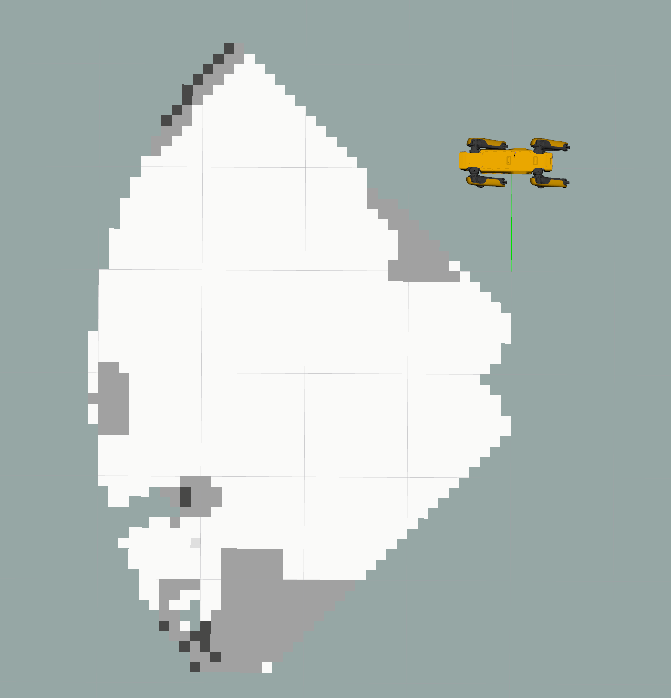

# 1. About the package <a name="atp"></a>
 **Course:**  Multidisciplinary Project (RO47007) \
 **Program:** Msc Robotics @ TU Delft            
 **Developer Group:**  Group 19 - SpotOnCare                     
 **Last Maintained Date:**  01.06.2023   

This repository is part the submission for the project of the course **Multidisciplinary Project (RO47007)**, in collaboration with  [TNO](https://www.tno.nl/en?gclid=.CjwKCAjw1MajBhAcEiwAagW9MSsTkBs0QeVZAyaxq9Fz1mtmGNJCkYzUVTuIwKk3bHhMCr6WwW6XnhoCvmsQAvD_BwE).


The package provides the necessary code to build and run the RRT-algorithm that is part of the planning/navigation part of the project.

  
It contains all necessary files to build one ROS node, namely: 
- ``rrt_path_node`` 

This package can be used in combination with the other ROS packages contained in the parent repository ``champ_spot`` to simulate and run autonomous missions designed for the healthcare sector on a [Boston Dynamics SPOT robot](https://www.bostondynamics.com/products/spot).

--- 

# Table of Contents

1.  [About the package](#atp) \
    1.1 [ROS-Node rrt_path](#r1)

2. [Usage](#u)\
    2.1 [Starting the simulation](#rsim)\
    2.2 [Running the rrt_path_node](#rbrac)\
    2.3 [Running the node individually](#rind)

3. [File Structure](#fs)


---

<p>&nbsp;</p>


## ROS-Node rrt_path_node <a name="r1"></a>
The ``rrt_path`` node contains all the necessary files to build a collision free path with a RRT algorithm to a given goal position from a known map that is created in the ``occupancy_map`` node. This node publishes the path from start to goal to the ``motion control``/``trajectory_node`` node, which will make the Spot move to the goal. The goal is retrieved from the server. This goal will be created by the ``detection``, ``explore/search`` or ``human interaction`` nodes.

TODO: RIGHT NODE NAMES IN HERE!

<!--
- Given a the goal position in the OccupancyGrid and using the RRT algorithm, creates a path consisting of MoveBaseAction goals.
- Sends a GoalStatusArray to the ``trajectory_node`` to execute the path. -->

This node is subscribed and publishes to the topics below.
| **Subscribes:**               | **Publishes:**                    |
|-------------------------------|-----------------------------------|
| /spot/mapping/grid_location | /spot/planning/path_steps |
| /spot/mapping/occupancy_grid  | /spot/motion control? |
| /spot/ detection  ? | |
| /spot/ Human interaction ? | |
| /spot/ explore ? | |

TODO: RIGHT TOPIC NAMES!

The node subscribes to the nodes that could give a possible goal to the RRT Algorithm and publishes the Path to RViz that should look like this.\
OR?
The node publishes the Path to RViz that should look like this.


TODO: PICTURE OF THE PATH
<!-- <div style="text-align:center">
 
</div> -->

# 2. Usage <a name="u"></a>

After building the packages and sourcing your workspace (follow all the steps in **Getting started**) each of the contained nodes in the workspace can be started using ``roslaunch`` and the provided launch files. However, because all the nodes described in this README depend on each other, it is recommended to launch them all at once after the World in Gazebo and SPOT in Rviz have spawned.

### Starting the simulation <a name="rsim"></a>
The simulation should be running (the world in Gazebo and SPOT in Rviz), before the nodes within this package can be launched. This can be done using the two commands below.

Launch the world in Gazebo.
```console
roslaunch spot_config spawn_world.launch
```
Launch SPOT in Rviz.
```console
roslaunch spot_config spawn_robot.launch
```

This will startup both Gazebo and Rviz, SPOT should also be visible within the Gazebo world.

<div style="text-align:center">
 
</div>

### Running RRT <a name="rbrac"></a>

If the simulation started, all the nodes described within this README can be launched using one launch file:

```console
roslaunch rrt rrt.launch
```

The RRT launch file will launch: \
The ``roslaunch slam mapping.launch`` launch file, the ``grid_position_transform`` node and the ``rrt_path`` node.

It is important to note that the goal is not obtained in this launch file. This will come from the ``detection, Human interaction or explore/search `` nodes.

TODO: Get the right names in here!

#### Occupancy map
The created occupancy map can be visualized in Rviz by clicking on:
``Panels`` &rarr; ``Add`` &rarr; ``Topics`` &rarr; ``/spot/mapping/occupancy_grid``

This should display the occupancy map as shown in the image below. 
<div style="text-align:center">
 
</div

Note however, that the robots position in Rviz does not match the robot position used by the occupancy map. This difference is due to a simulation error and/or position drift. Theirfore, it is recomanded to hide the robot model in Rviz.

To visualize how the occupancy map updates over time, the movement of SPOT can be simulated using the keyboard. This can be done by running the command below:
```console
roslaunch champ_teleop teleop.launch
```


When you now move around SPOT, the occupancy map will update accordingly as the visible GIF above.

#### Grid position transform
This node will transform the position into grid values that is needed for obstacle avoidance.

#### RRT path
When there is a goal presented on the server. The goal will be used in the ``rrt_path`` node. The node will calculate a valid path and publish it to RViz.\
The RRT path can be visualized in RViz by clicking on:
``Panels`` &rarr; ``Add`` &rarr; ``Topics`` &rarr; ``/spot/planning/path_steps``

It should display the RRT path as shown in the image below. 

TODO: PICTURE OF THE PATH
<!-- <div style="text-align:center">
 
</div -->

Where:
- The Green line: is the path created by the RRT Algorithm.
- The Blue Point: is the starting position of the Spot.
- The Red Point: is the goal position where Spot will go while following the path.


### Running all the nodes individually <a name="rind"></a>
Every node has his own launch file to control the dependencies.

Run the node ``rrt_path``:
```console
roslaunch rrt rrt_path.launch
```

## 4. File Structure <a name="fs"></a>

````
├── action
│   └── Motion.action                   # Action files for the conversation server
├── CMakeLists.txt                      # CMakeLists.txt for the package
├── images                              # Images and GIFs used in the README
│   ├── occupancy_map.png
│   ├── simulation.png
│   └── update_slam.gif
│   └── TODO: PATH.png TODO: PICTURE OF THE PATH

├── launch                              # Launch files
│   ├── rrt.launch
│   └── rrt_path.launch
├── package.xml
├── README.md
└── src
    └── rrt_path.py                     # Definition of the rrt_path node
````
