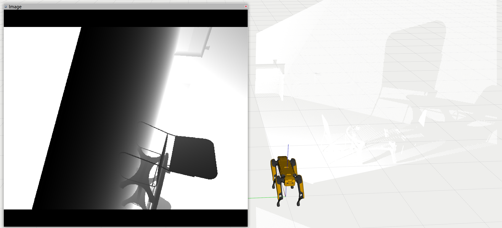
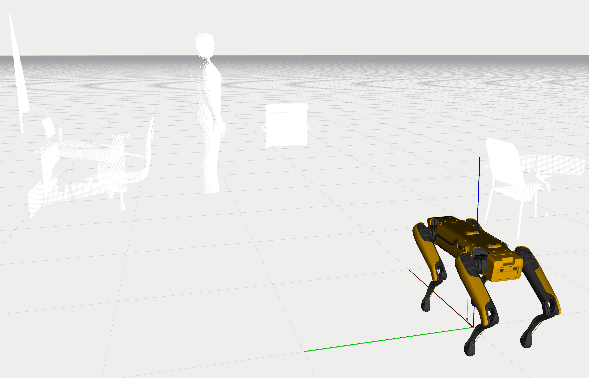
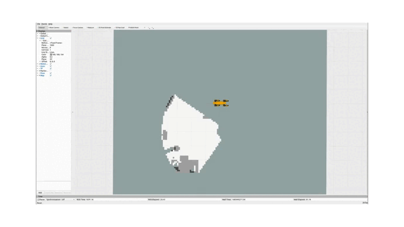
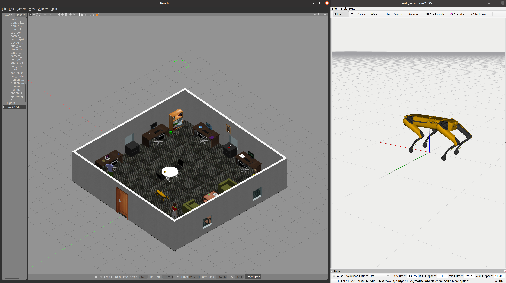
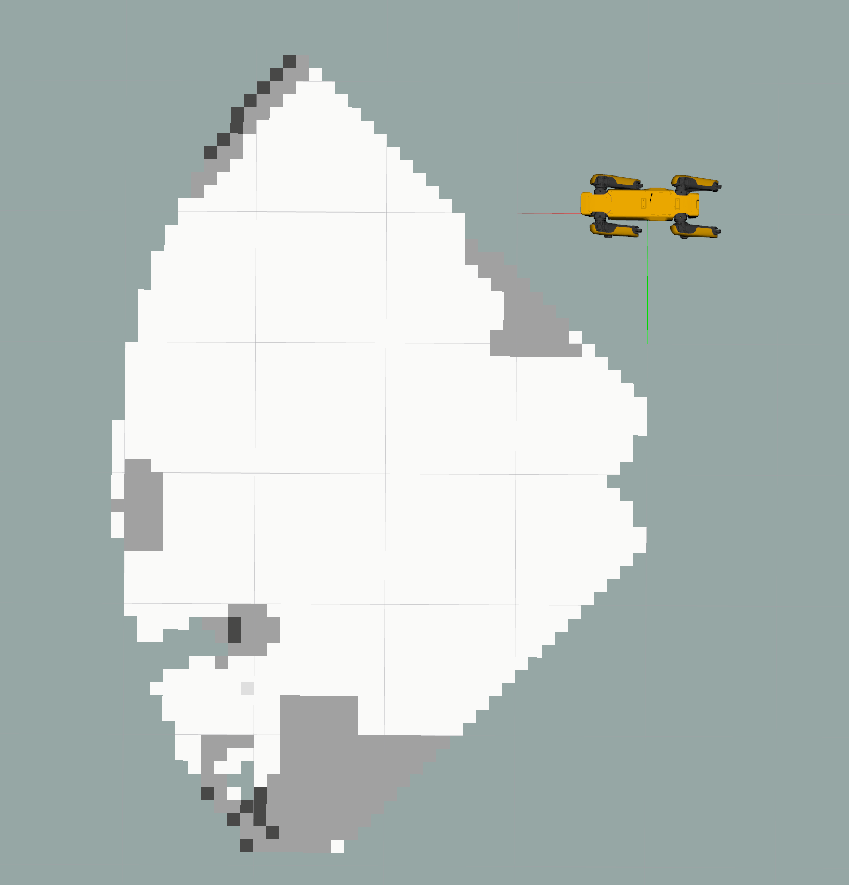

# 1. About the package <a name="atp"></a>
 **Course:**  Multidisciplinary Project (RO47007) \
 **Program:** Msc Robotics @ TU Delft            
 **Developer Group:**  Group 19 - SpotOnCare                     
 **Last Maintained Date:**  01.06.2023   


This repository is part the submission for the project of the course **Multidisciplinary Project (RO47007)**, in collaboration with  [TNO](https://www.tno.nl/en?gclid=.CjwKCAjw1MajBhAcEiwAagW9MSsTkBs0QeVZAyaxq9Fz1mtmGNJCkYzUVTuIwKk3bHhMCr6WwW6XnhoCvmsQAvD_BwE).


This package provides the necessary code to build and run the Self-Localization And Mapping (later referred to as SLAM) part of the project.

  
It contains all necessary files to build two ROS nodes, namely: 
- ``image2pointcloud`` 
- ``plane_segmentation``
- ``occupancy_map`` 

These packages can be used in combination with the other ROS packages contained in the parent repository ``champ_spot`` to simulate and run autonomous missions designed for the healthcare sector on a [Boston Dynamics SPOT robot](https://www.bostondynamics.com/products/spot).

--- 

# Table of Contents

1.  [About the package](#atp) \
    1.1 [ROS-Node image2pointcloud](#r1)\
    1.2 [ROS-Node plane_segmentation](#r2)\
    1.3 [ROS-Node occupancy_map](#r3)

2. [Usage](#u)\
    3.1 [Starting the simulation](#rsim)\
    3.2 [Running SLAM](#rslam)\
    3.3 [Running all the nodes individually](#rind)
    
    
3. [File Structure](#fs)


---

<p>&nbsp;</p>


## ROS-Node image2pointcloud <a name="r1"></a>
The ``image2pointcloud`` node contains all the necessary files to transform depth images measured/created by SPOT into 3D point clouds. These point clouds are then used by other machine perception and planning nodes.

This node is subscribed and publishes to the topics below.
| **Subscribes:**               | **Publishes:**                    |
|-------------------------------|-----------------------------------|
| depth/frontright/camera/image | /spot/depth/frontright/pointcloud |
| depth/frontleft/camera/image  | /spot/depth/frontleft/pointcloud  |

The incoming depth images and the resulting point clouds should look like this.

<div style="text-align:center">
 
</div>

## ROS-Node plane_segmentation <a name="r2"></a>
The ``plane_segmentation`` node contains all the necessary files to perform ground plane segmentation. The segmentation is defined by a hardcoded Z-height threshold to reduce computational time and under the assumption that the ground is flat. The segmented point cloud is used in another node to create an occupancy map.

This node is subscribed and publishes to the topics below.
| **Subscribes:**                   | **Publishes:**                            |
|-----------------------------------|-------------------------------------------|
| /spot/depth/frontright/pointcloud | /spot/depth/plane_segmentation/non_ground |
| /spot/depth/frontleft/pointcloud  | /spot/depth/plane_segmentation/ground     |

The node creates two separate point clouds, one containing only the ground points and one containing only all the non-ground points.

<div style="text-align:center">
 
</div>

## ROS-Node occupancy_map <a name="r3"></a>
The ``occupancy_map`` node contains all the necessary files to create an [occupancy map](https://automaticaddison.com/what-is-an-occupancy-grid-map/). This occupancy map is created using the segmented point clouds and maps the environment in 2D based on the occupancy likelihood. Each gridcell within the map has an occupied likelihood between 0 and 100 or is undiscovered, indicated by a value of -1.

This node is subscribed and publishes to the topics below.
| **Subscribes:**                           | **Publishes:**               |
|-------------------------------------------|------------------------------|
| /spot/depth/plane_segmentation/non_ground | /spot/mapping/occupancy_grid |
| /spot/depth/plane_segmentation/ground     |                              |
| /odom/ground_truth                        |                              |

The created occupancy map updates dynamically when SPOT is moving. 



# 2. Usage <a name="u"></a>

After building the packages and sourcing your workspace (follow all the steps in **Getting started**) each of the contained nodes in the workspace can be started using ``roslaunch`` and the provided launch files. However, because all the nodes described in this README depend on each other, it is recommended to launch them all at once after the World in Gazebo and SPOT in Rviz have spawned.


### Starting the simulation <a name="rsim"></a>
The simulation should be running (the world in Gazebo and SPOT in Rviz), before the nodes within this package can be launched. This can be done using the two commands below.

Launch the world in Gazebo.
```console
roslaunch spot_config spawn_world.launch
```
Launch SPOT in Rviz.
```console
roslaunch spot_config spawn_robot.launch
```

This will startup both Gazebo and Rviz, SPOT should also be visible wihtin the Gazebo world.

<div style="text-align:center">
 
</div>

### Running SLAM <a name="rslam"></a>
If the simulation started, all the nodes described within this README can be launched using one launch file:
```console
roslaunch slam mapping.launch
```
The created occupancy map can be visualized in Rviz by clicking on:
``Panels`` &rarr; ``Add`` &rarr; ``Topics`` &rarr; ``/spot/mapping/occupancy_grid``

This should display the occupancy map as shown in the image below. 
<div style="text-align:center">
 
</div

Note however, that the robots position in Rviz does not match the robot position used by the occupancy map. This difference is due to a simulation error and/or position drift. Theirfore, it is recomanded to hide the robot model in Rviz.

To visualize how the occupancy map updates over time, the movement of SPOT can be simulated using the keyboard. This can be done by running the command below:
```console
roslaunch champ_teleop teleop.launch
```
When you now move arround SPOT, the occupancy map will update accordingly as visible GIF above.

### Running all the nodes individually <a name="rind"></a>
Every node has his own launch file to control the dependencies.

Run the node ``image2pointcloud``:
```console
roslaunch slam image2pointcloud.launch
```

Run the node ``plane_segmentation``:
```console
roslaunch slam plane_segmentation.launch
```

## 3. File Structure <a name="fs"></a>

````
├── action
│   └── Motion.action                   # Action files for the conversation server
├── CMakeLists.txt                      # CMakeLists.txt for the package
├── config                              # Configuration files for both packages
│   ├── occupancy_grid.yaml
│   └── plane_segmentation.yaml
├── images                              # Images and GIFs used in the README
│   ├── depth_image.png
│   ├── occupancy_map.png
│   ├── segmentation.png
│   ├── simulation.png
│   └── update_slam.gif
├── launch                              # Launch files
│   ├── active_slam.launch
│   ├── frontier_exploration.launch
│   ├── image2pointcloud.launch
│   ├── mapping.launch
│   └── plane_segmentation.launch
├── package.xml
├── README.md
└── src
    ├── change_frame_id.py
    ├── explore_frontiers.py
    ├── explore.py
    ├── grid_position_transform.py
    ├── image2pointcloud.py             # Definition of the image2pointcloud node
    ├── motion_control.py
    ├── occupancy_map.py                # Definition of the occupancy_map node
    └── plane_segmentation.py           # Definition of the plane_segmentation node
```` 
