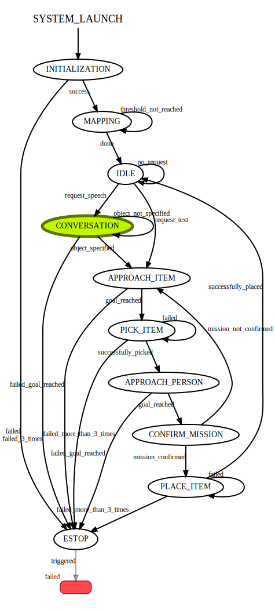

# 1. About the package <a name="atp"></a>
 **Course:**  Multidisciplinary Project (RO47007) \
 **Program:** Msc Robotics @ TU Delft            
 **Developer Group:**  Group 19 - SpotOnCare                     
 **Last Maintained Date:**  01.06.2023   


This repository is part the submission for the project of the course **Multidisciplinary Project (RO47007)**, in collaboration with  [TNO](https://www.tno.nl/en?gclid=.CjwKCAjw1MajBhAcEiwAagW9MSsTkBs0QeVZAyaxq9Fz1mtmGNJCkYzUVTuIwKk3bHhMCr6WwW6XnhoCvmsQAvD_BwE).


This package provides the necessary code to build and run the ``state machine`` part of the project.

  
It contains all necessary files to build one ROS nodes, namely: 
- ``state_machine`` 


These packages can be used in combination with the other ROS packages contained in the parent repository ``champ_spot`` to simulate and run autonomous missions designed for the healthcare sector on a [Boston Dynamics SPOT robot](https://www.bostondynamics.com/products/spot).

--- 

# Table of Contents

1.  [About the package](#atp) \
    1.1 [ROS-Node state_machine](#r1)


2. [Usage](#u)\
    2.1 [Starting the simulation](#rsim)\
    2.2 [Running necessary launch files](#rslam)\
    2.3 [Confirming correct launch](#conf)
    
3. [File Structure](#fs)


---

<p>&nbsp;</p>


## ROS-Node state_machine <a name="r1"></a>
The ``state_machine`` node contains all the necessary files to implement a [``SMACH``](http://wiki.ros.org/smach)- based behaviour model that connects all the nodes, possible services and action servers. Thereby it enables the coordinated execution of tasks
and proper system behavior by handling different states and their respective transitions.
It manages the following states:

- INITIALIZATION: All the required nodes and servers are launched and the GUI is booted on the smartwatch/bracelet. If errors occur, the ESTOP is triggered and the state machine terminates with "failed". If INITIALIZATION was successful, the transition to MAPPING happens.

- MAPPING: The final goal of that state is to create a 2D occupancy grid of the environment and build up a database containing the detected objects and persons and their respective locations. To ascertain the completion of the MAPPING process, a predefined threshold is evaluated that measures the rate of change in the map per scan. If that threshold is reached, the transition to the state IDLE is made when there is no mission given yet. As long as the threshold is not reached, MAPPING will be repeated.

- IDLE: Spot remains idle and sits down on the ground until a request is given either by using spoken natural language in CONVERSATION or the text entry on their bracelet. In both cases, Spot will transition to APPROACH_ITEM.

- CONVERSATION: activates the conversation server to give a new mission and if an object is specified, the state APPROACH_ITEM is triggered. If the conversation fails three times in a row, the ESTOP is triggered.

- APPROACH_ITEM: generates and executes a path to the specified item based on a query of the database that was created during mapping. If Spot reached the goal, the next state is PICK_ITEM, if the item could not be approached, the mission is aborted.

- PICK_ITEM: requests the operator to pick up the object Spot is standing in front using the controller. If the item picking fails, it will be executed again. Once it fails 3 times in a row, the mission will be aborted and the ESTOP will be triggered. After successful picking, the state APPROACH_PERSON follows.

- APPROACH_PERSON: generates and executes a path to the person that requested the item to be delivered. If Spot reached the person, the next state is CONFIRM_MISSION, if the item could not be approached, the mission is aborted and the ESTOP is activated.

- CONFIRM_MISSION: determines in a conversation whether the item brought is correct. If that is the case, it executes PLACE_ITEM. If that is not the case, the item will be returned to its original location through the execution of the state APPROACH_ITEM and placed back.

- PLACE_ITEM: requests the operator to place down the object Spot is holding using the controller. If the item placing fails, it will be executed again. Once it fails 3 times in a row, the mission will be aborted and the ESTOP will be triggered. After successful placing, the state IDLE follows for Spot to take on new missions.

- ESTOP: triggers the ROS-service /spot/estop/gentle in order to abort all current actions and make Spot sit down and shut down all motors. After executing that state, the state machine will terminate with the status "failed".


# 2. Usage <a name="u"></a>

After building the packages and sourcing your workspace (follow all the steps in **Installation** of the [main README](../README.md)) each of the contained nodes in the workspace can be started using ``roslaunch`` and the provided launch files. 


### Starting the simulation <a name="rsim"></a>
The simulation should be running (the world in Gazebo and SPOT in Rviz), before the nodes within this package can be launched. This can be done using the two commands below.

Launch the world in Gazebo.
```
roslaunch spot_config spawn_world.launch
```
Launch SPOT in Rviz.
```
roslaunch spot_config spawn_robot.launch
```

This will startup both Gazebo and Rviz, SPOT should also be visible within the Gazebo world.

<div style="text-align:center">
 
</div>


To enable all necessary visualizations in Rviz, you can open the rviz file ``spot_panels`` provided in this package in the folder ``rviz`` . 


### Running necessary launch files <a name="rslam"></a>
If the simulation started, all the nodes described within this project can be launched using the following commands. Please note, that the commands have to be executed in 3 different terminals and in the given order, to enable full functionality of the system. Note, that putting all the commands in one launch file is omitted, to have a good overview of what was launched and to have logging in different terminals. Using the roslaunch option to enable multiple terminals after launch did not work for some machines and is therefore not used.


**Enabling all the mapping nodes**
```
roslaunch slam mapping.launch
```

**Enabling all the necessary other nodes (Detection, Path Planning, Human Interaction, Motion Control and Exploration)**
```
roslaunch state_machine state_machine.launch
```


**Running the state machine**
```
rosrun state_machine state_machine.py
```

### Confirming correct launch <a name="conf"></a>


 **Expected output**\
After running the commands above, the output of the state machine should look like this:

 ```
 [INFO] [1686592471.312084, 9140.519000]: State machine starting in initial state 'INITIALIZATION'
[WARN] [1686592471.318391, 9140.519000]: System is initializing...
[INFO] [1686592474.879934, 9143.551000]: Node '/plane_segmentation' is running
[INFO] [1686592474.896019, 9143.562000]: Node '/yolo_detection' is running
[INFO] [1686592474.913292, 9143.572000]: Node '/occupancy_map' is running
[INFO] [1686592474.926556, 9143.585000]: Node '/grid_position_transform' is running
[INFO] [1686592474.933004, 9143.590000]: Waiting for 'explore' action server...
[INFO] [1686592474.937171, 9143.594000]: Waiting for 'conversation' action server...
[INFO] [1686592474.941765, 9143.595000]: Waiting for 'rrt_path' action server...
[INFO] [1686592474.950189, 9143.600000]: Waiting for 'motion_control' action server...
[INFO] [1686592474.950189, 9143.800000]: All action servers are running
[INFO] [1686592478.559609, 9146.602000]: State machine transitioning 'INITIALIZATION':'success'-->'MAPPING'
```
If it does, the system is ready to be used. All necessary nodes and servers are running and the state machine is started the MAPPING state.

On top of that, you should see the GUI and SPOT should start the autonomous mission in Gazebo.

 **Using ``Smach Viewer``**\
To confirm the correct launch of the system and for introspection during runnning, you can launch a ``Smach Viewer``, which will show the current state of the state machine. This can be done using the following command.
```
rosrun smach_viewer smach_viewer.py
```

Its output should look like this:


<div style="text-align:center">
 
</div>


## 3. File Structure <a name="fs"></a>

````
├── CMakeLists.txt                  # compiler instructions
├── images                          # images for the README
│   └── smach_viewer.svg
├── launch                          # launch files
│   └── state_machine.launch
├── package.xml                     # package info
├── README.md                       # README
├── rviz                            # rviz files     
│   └── spot_panels.rviz
└── src                             # source files
    ├── state_machine.py
```` 
