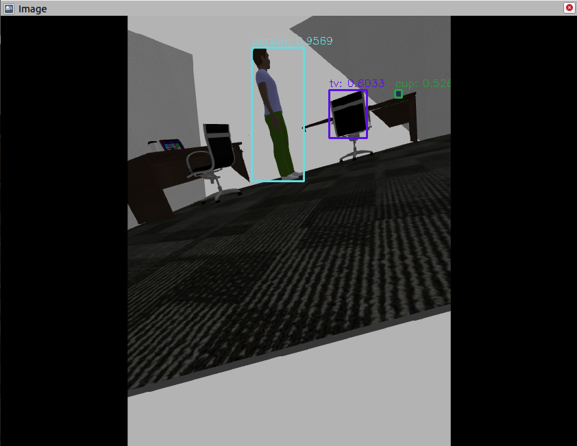

# 1. About the package <a name="atp"></a>
 **Course:**  Multidisciplinary Project (RO47007) \
 **Program:** Msc Robotics @ TU Delft            
 **Developer Group:**  Group 19 - SpotOnCare                     
 **Last Maintained Date:**  25.05.2023   


This repository is part the submission for the project of the course **Multidisciplinary Project (RO47007)**, in collaboration with  [TNO](https://www.tno.nl/en?gclid=.CjwKCAjw1MajBhAcEiwAagW9MSsTkBs0QeVZAyaxq9Fz1mtmGNJCkYzUVTuIwKk3bHhMCr6WwW6XnhoCvmsQAvD_BwE).


The package provides the necessary code to build and run the yolo detecion code. 

  
It contains all necessary files to build one ROS node, namely: 
- ``detection`` 

This package can be used in combination with the other ROS packages contained in the parent repository ``champ_spot`` to simulate and run autonomous missions designed for the healthcare sector on a [Boston Dynamics SPOT robot](https://www.bostondynamics.com/products/spot).

--- 

# Table of Contents

1.  [About the package](#atp) \
    1.1 [ROS-Node detection_node](#r1)

2. [Getting Started](#gs)\
    2.1 [Prerequisites](#pr)\
    2.2 [Installation](#i)\
    2.3 [Optional yolov3](#pra)

3. [Usage](#u)\
    3.1 [Running the detection_node](#rbrac)
    
4. [File Structure](#fs)
---

<p>&nbsp;</p>

## ROS-Node detection <a name="r1"></a>
The package contains all the necessary files to build and run ``detection`` that:
- Detects persons and then uses point-cloud data to assign a 3d location to the person, this data is then published.
- Detects persons and objects and draws bounding boxes around them. The images with bounding boxes are published.

This node is subscribed and publishes to the topics below.
| **Subscribes:**                                   | **Publishes:**                    |
|---------------------------------------------------|-----------------------------------|
| /spot/camera/frontleft/image                      | /spot/camera/boundingBoxCamera    |
| /spot/camera/frontright/image                     |                                   |
| /spot/depth/plane_segmentation/non_ground         |                                   |

Furthermore the node request information regarding the both cameras from:
- /spot/camera/frontright/camera_info
- /spot/camera/frontleft/camera_info


# 2. Getting Started <a name="gs"></a>
## Prerequisites <a name="pr"></a>
This project was developed and tested on a Ubuntu 20.04 LTS machine running ROS Noetic. The following steps will guide you through the process of setting up the workspace and running the project.


## Installation <a name="i"></a>
**1. CHAMP installation**

If you have not done so yet, follow the instructions to setup the CHAMP workspace on your machine: 
[CHAMP Installation](https://gitlab.tudelft.nl/cor/ro47007/2023/team-19/champ_spot). This will guide you through the installation of our version of the CHAMP repository containing all the necessary packages to run the project.


**2. Install the following dependencies:**

```python
cv_bridge==1.16.2
message_filters==1.16.0
numpy==1.17.4
opencv_python==4.7.0.72
rospkg==1.5.0
rospkg_modules==1.5.0
rospy==1.16.0
sensor_msgs==1.13.1
tf==1.13.2
```

**3. Configure yolo**

The weights for the model can be downloaded inside of yolo_config:

```bash
cd yolo_config
wget https://github.com/AlexeyAB/darknet/releases/download/yolov4/yolov7x.weights
```


## Optional yolov3 configuration <a name="pra"></a>
The model uses yolov7 however if you want to use yolov3 you can download the weights with the following command:

```bash
cd yolo_config
wget https://pjreddie.com/media/files/yolov3.weights
```
You would need to change the path to the configuration files, this can be done by browsing to the src folder and opening the yolo_detection.py file. Then you have to change the following code:

```python
file_path_cfg = 'yolo_config/yolov7x.cfg'
file_path_weight = 'yolo_config/yolov7x.weights'
```
to:
```python
file_path_cfg = 'yolo_config/yolov3.cfg'
file_path_weight = 'yolo_config/yolov3.weights'
```


# 3. Usage <a name="u"></a>
## Running the detection_node <a name="rbrac"></a>

After building the packages and sourcing your workspace (follow all the steps in **Getting started** and all the steps in the **slam** package). The full simulation can then be run using:
```bash
roslaunch spot_config spawn_world.launch
```

Wait untill the simulation has started up and then run:
```bash
roslaunch spot_config spawn_robot.launch rviz:=true
```

The node requires the slam node working:
```bash
roslaunch slam mapping.launch
```

to run the node you can then call:
```bash
rosrun yolo yolo_detection.py 2> >(grep -v TF_REPEATED_DATA buffer_core)
```

The part behind yolo_detection.py makes sure terminal is not flooded with warnings from tf (tf has a known issue that is non-critical)

You can then add the image with bounding boxes to rviz to view the result, it should look something like this:

<div style="text-align:center">
 
</div>


## 4. File Structure <a name="fs"></a>

```txt
├── CMakeLists.txt
├── images
│   └── EXAMPLE.png
├── launch
│   └── world_spot.launch
├── package.xml
├── README.md
├── src
│   └── yolo_detection.py
└── yolo_config
    ├── coco.names
    ├── yolov3.cfg
    ├── yolov3.weights
    ├── yolov7x.cfg
    └── yolov7x.weights
```

